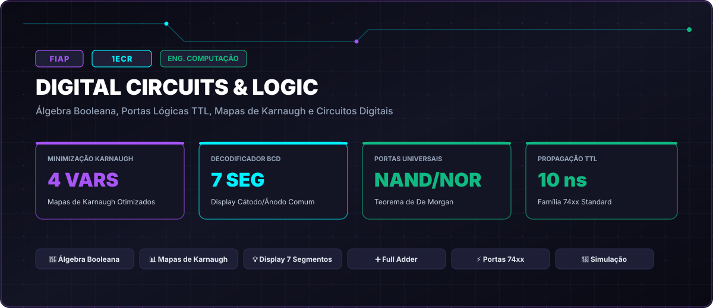

# FIAP • Digital Circuits & Logic (Turma 1ECR • 2022)

> **Engenharia da Computação — FIAP (Faculdade de Informática e Administração Paulista)**  
> **Turma:** 1ECR • Ano Letivo 2022  
> **Portal Interativo GitHub Pages:** [https://guimemee.github.io/fiap-digital-circuits-and-logic/](https://guimemee.github.io/fiap-digital-circuits-and-logic/)

---

## 📋 Sumário Executivo

Este repositório consolida o acervo acadêmico integral e os projetos práticos de engenharia da disciplina **Digital Circuits & Logic**, contemplando:
1. **6 Checkpoints Oficiais (2022):** Enunciados integrais originais, memórias de cálculo passo a passo no padrão Symbolab e cadernos Jupyter (`.ipynb`) com gráficos executáveis.
2. **Apostilas e Teoria:** Slides e referências didáticas.
3. **Exercícios de Laboratório:** Guias práticos e simulações.
4. **Global Solution:** Projetos integradores do semestre.

---

## 🎯 6 Checkpoints Oficiais

- **Checkpoint 1: Modelagem de Interruptores e Portas Lógicas Básicas:** [`01_Checkpoints_2022/Checkpoint_1_Cuit_Parte_1_Interruptores/Resolucao_Calculos.ipynb`](01_Checkpoints_2022/Checkpoint_1_Cuit_Parte_1_Interruptores/Resolucao_Calculos.ipynb)
- **Checkpoint 2: Verificação Formal de Tautologias e Modus Ponens:** [`01_Checkpoints_2022/Checkpoint_2_Cuit_Parte_2_Conectivos_Logicos/Resolucao_Calculos.ipynb`](01_Checkpoints_2022/Checkpoint_2_Cuit_Parte_2_Conectivos_Logicos/Resolucao_Calculos.ipynb)
- **Checkpoint 3: Comparador de Magnitude Digital de 1 Bit:** [`01_Checkpoints_2022/Checkpoint_3_Provas_Presenciais_Bancada_1Sem/Resolucao_Calculos.ipynb`](01_Checkpoints_2022/Checkpoint_3_Provas_Presenciais_Bancada_1Sem/Resolucao_Calculos.ipynb)
- **Checkpoint 4: Universalidade de Portas Lógicas NAND:** [`01_Checkpoints_2022/Checkpoint_4_Portas_Integradas_e_Equivalencias/Resolucao_Calculos.ipynb`](01_Checkpoints_2022/Checkpoint_4_Portas_Integradas_e_Equivalencias/Resolucao_Calculos.ipynb)
- **Checkpoint 5: Somador Completo de 1 Bit (Full Adder):** [`01_Checkpoints_2022/Checkpoint_5_Parte_NAC_Circuits_Esquematico/Resolucao_Calculos.ipynb`](01_Checkpoints_2022/Checkpoint_5_Parte_NAC_Circuits_Esquematico/Resolucao_Calculos.ipynb)
- **Checkpoint 6: Decodificador BCD para Display de 7 Segmentos (Segmento 'a'):** [`01_Checkpoints_2022/Checkpoint_6_NAC3_II_Karnaugh_e_Display_7_Segmentos/Resolucao_Calculos.ipynb`](01_Checkpoints_2022/Checkpoint_6_NAC3_II_Karnaugh_e_Display_7_Segmentos/Resolucao_Calculos.ipynb)

---

## 🏛️ Créditos e Rastreabilidade
- **Instituição:** FIAP
- **Curso:** Engenharia da Computação
- **Turma:** 1ECR • 2022
- **Aluno:** Guilherme Macario da Silva
